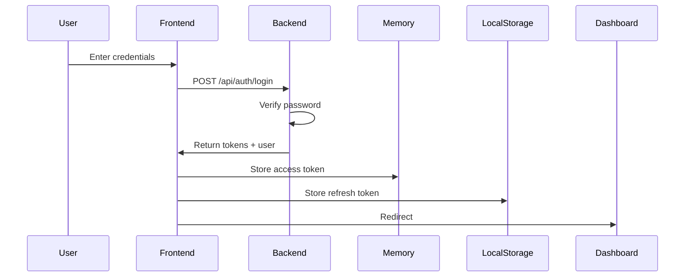
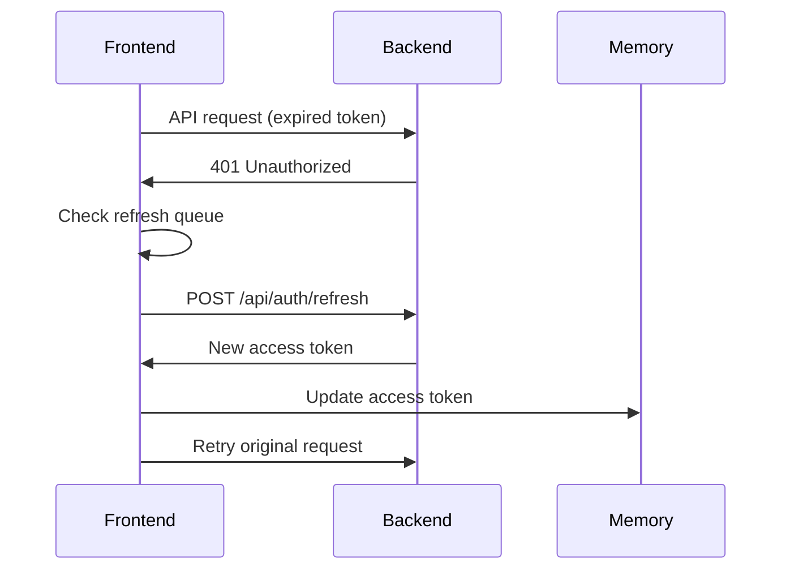
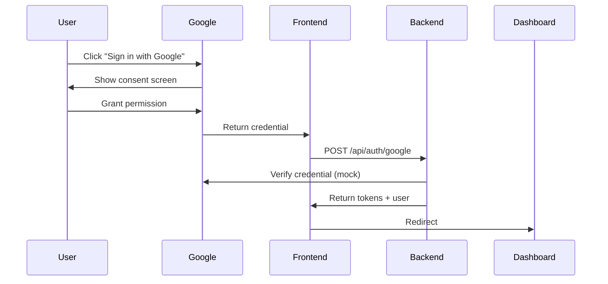

# 📧 Email Dashboard - React Application with Gmail API Integration

A complete, production-ready email dashboard application built with **React**, **TypeScript**, **Gmail API**, and **OAuth2** authentication following industry best practices.


## ✨ Overview

This project implements **Track A (Gmail API Integration)** with a complete OAuth2 Authorization Code Flow, allowing users to access their real Gmail account through a modern, responsive web interface.

### 🎯 Key Features

**Gmail Integration (Track A)**

- ✅ **OAuth2 Authorization Code Flow** (server-side token exchange)
- ✅ **Real Gmail Access** - Read, send, and modify your actual Gmail
- ✅ **Secure Token Management** - Refresh tokens stored server-side only
- ✅ **Automatic Token Refresh** - Seamless experience, never interrupted
- ✅ **Gmail API Proxy** - Backend handles all Gmail API calls securely

**Authentication**

- ✅ **Google OAuth 2.0** Sign-In with proper authorization flow
- ✅ **Demo Account** - Email/password login with mock data
- ✅ **JWT Token Management** (access + refresh tokens)
- ✅ **Concurrency Lock** - Prevents multiple refresh attempts
- ✅ **Protected Routes** - Automatic authentication checks

**Email Features**

- ✅ **3-Column Responsive Layout** - Mailboxes, Email List, Email Detail
- ✅ **Real Gmail Operations** - Star, delete, mark read/unread, send emails
- ✅ **Attachment Support** - View and download email attachments
- ✅ **HTML Email Rendering** - Properly formatted email display
- ✅ **Search & Filter** - Find emails quickly
- ✅ **Compose & Reply** - Send new emails and reply to existing ones

📖 **[Complete Gmail Integration Guide →](GMAIL_INTEGRATION_GUIDE.md)**

## 🏗️ Architecture

### Project Structure

```
G_03/
├── backend/                    # Express.js + TypeScript API
│   ├── src/
│   │   ├── data/
│   │   │   ├── users.json     # Mock users
│   │   │   ├── mailboxes.json # Mailbox data
│   │   │   └── emails.json    # Email messages
│   │   ├── middleware/
│   │   │   └── auth.ts        # JWT verification
│   │   ├── routes/
│   │   │   ├── auth.ts        # Auth endpoints
│   │   │   ├── mailboxes.ts   # Mailbox endpoints
│   │   │   └── emails.ts      # Email endpoints
│   │   ├── utils/
│   │   │   └── hashPassword.ts
│   │   └── server.ts          # Main server
│   ├── package.json
│   ├── tsconfig.json
│   └── .env
│
├── frontend/                   # React + TypeScript + Vite
│   ├── src/
│   │   ├── api/
│   │   │   └── axios.ts       # Axios client + interceptors
│   │   ├── components/
│   │   │   ├── auth/
│   │   │   │   └── ProtectedRoute.tsx
│   │   │   └── dashboard/
│   │   │       ├── Sidebar.tsx
│   │   │       ├── EmailList.tsx
│   │   │       └── EmailDetail.tsx
│   │   ├── contexts/
│   │   │   └── AuthContext.tsx
│   │   ├── pages/
│   │   │   ├── Login.tsx
│   │   │   └── Dashboard.tsx
│   │   ├── types/
│   │   │   └── index.ts
│   │   ├── App.tsx
│   │   ├── main.tsx
│   │   └── index.css
│   ├── package.json
│   ├── tsconfig.json
│   ├── tailwind.config.js
│   └── .env
│
└── README.md (this file)
```

## 🚀 Quick Start

### Two Ways to Use This App

#### Option 1: Real Gmail Integration (Recommended)

Access your actual Gmail account with full OAuth2 security:

1. **[Follow the complete Gmail setup guide →](GMAIL_INTEGRATION_GUIDE.md)**

   - Set up Google Cloud Project
   - Enable Gmail API
   - Configure OAuth credentials
   - Takes ~10 minutes

2. Sign in with your Gmail account
3. Grant permissions
4. Access your real inbox!

#### Option 2: Demo Mode (Mock Data)

Quick start without Google Cloud setup:

```bash
# Demo credentials
Email: demo@example.com
Password: password123
```

Uses mock email data for testing the UI.

### Prerequisites

- Node.js 18+ and npm
- Git
- Google Cloud Account (for Gmail integration)

### 1. Clone Repository

```bash
cd d:\HK7_2025_2026\AWAD\G_03
```

### 2. Backend Setup

```bash
cd backend

# Install dependencies
npm install

# Configure environment
cp .env.example .env

# For Gmail integration: Edit .env and add your Google OAuth credentials
# For demo mode: Keep defaults

# Start backend server
npm run dev
```

Backend runs on: `http://localhost:5000`

### 3. Frontend Setup

```bash
cd ../frontend

# Install dependencies
npm install

# Configure environment
cp .env.example .env

# Start frontend development server
npm run dev
```

Frontend runs on: `http://localhost:5173`

### 4. Login

Open `http://localhost:5173` and either:

- **Click "Sign in with Gmail"** (requires Google Cloud setup)
- **Or use demo credentials:**
  ```
  Email: demo@example.com
  Password: password123
  ```

## 🔐 Authentication Flow

### Login Process



### Token Refresh Flow



### Google OAuth Flow



## 🛡️ Security Design

### Token Management

| Token Type        | Storage              | Lifetime   | Purpose                  | Security                                   |
| ----------------- | -------------------- | ---------- | ------------------------ | ------------------------------------------ |
| **Access Token**  | Memory (React state) | 15 minutes | API authentication       | XSS protected (not in localStorage)        |
| **Refresh Token** | localStorage         | 7 days     | Obtain new access tokens | HttpOnly cookie recommended for production |

### Why This Approach?

#### ✅ Access Token in Memory

- **Protection**: Not accessible via JavaScript injection (XSS)
- **Trade-off**: Lost on page refresh, but immediately recovered
- **Best Practice**: Recommended by OAuth 2.0 security guidelines

#### ✅ Refresh Token in localStorage

- **Convenience**: Persists across sessions
- **Recovery**: Automatically obtains new access token
- **Risk Mitigation**: Short access token lifetime limits exposure
- **Production**: Should use HttpOnly cookies (see stretch goals)

### Concurrency Lock Pattern

```typescript
// Prevents multiple simultaneous refresh requests
let isRefreshing = false;
let failedQueue = [];

const processQueue = (error, token = null) => {
  failedQueue.forEach((prom) => {
    if (error) prom.reject(error);
    else prom.resolve(token);
  });
  failedQueue = [];
};

// On 401 error
if (isRefreshing) {
  // Queue this request
  return new Promise((resolve, reject) => {
    failedQueue.push({ resolve, reject });
  });
}

isRefreshing = true;
// Perform refresh...
processQueue(null, newToken);
isRefreshing = false;
```

**Benefits:**

- ✅ Only ONE refresh request even with 100 concurrent API calls
- ✅ All failed requests retry with new token
- ✅ Prevents refresh token exhaustion
- ✅ Better UX (no multiple auth prompts)

## 📊 API Reference

### Backend Endpoints

#### Authentication

```typescript
POST / api / auth / login; // Email/password login
POST / api / auth / google; // Google OAuth login
POST / api / auth / refresh; // Refresh access token
```

#### Mailboxes

```typescript
GET    /api/mailboxes       // Get all mailboxes
GET    /api/mailboxes/:id/emails  // Get emails in mailbox
```

#### Emails

```typescript
GET    /api/emails/:id      // Get email details
PATCH  /api/emails/:id      // Update email (read, star)
DELETE /api/emails/:id      // Delete email
```

### Frontend API Client

```typescript
// Automatic token injection
import apiClient from "./api/axios";

// All requests include: Authorization: Bearer <token>
const emails = await apiClient.get("/mailboxes/inbox-1/emails");

// 401 errors trigger automatic refresh
// Original request retries with new token
```

## 🎨 UI Components

### 3-Column Dashboard Layout

```
┌────────────────────────────────────────────────────┐
│  Header: Logo, User Info, Sign Out                │
├───────────┬────────────────────┬───────────────────┤
│           │                    │                   │
│ Mailboxes │    Email List      │   Email Detail    │
│  (~20%)   │     (~40%)         │      (~40%)       │
│           │                    │                   │
│ • Inbox   │ ┌────────────────┐ │ Subject          │
│ • Starred │ │ Search         │ │ From: ...        │
│ • Sent    │ │ [    ][Refresh]│ │ To: ...          │
│ • Drafts  │ └────────────────┘ │                  │
│ • Archive │                    │ Email Body...    │
│ • Trash   │ ☐ ⭐ From         │                  │
│           │    Subject...      │ Attachments      │
│   [3]     │    Preview...      │ [Reply] [Delete] │
│           │    2h ago          │                  │
└───────────┴────────────────────┴───────────────────┘
```

### Responsive Behavior

- **Desktop**: 3-column layout
- **Tablet**: 2-column (mailboxes collapse to icon sidebar)
- **Mobile**: Single column with navigation

## 🧪 Testing the Application

### Test Scenarios

1. **Login Flow**

   ```
   ✓ Valid credentials → Dashboard
   ✓ Invalid credentials → Error message
   ✓ Google OAuth → Dashboard
   ✓ Empty fields → Validation error
   ```

2. **Token Refresh**

   ```
   ✓ Wait 16 minutes → Auto refresh
   ✓ Make API call → Token refreshes automatically
   ✓ Multiple calls → Only one refresh request
   ```

3. **Email Operations**

   ```
   ✓ Click email → Display in detail pane
   ✓ Star email → Updates icon
   ✓ Delete email → Removed from list
   ✓ Mark as read → Updates styling
   ✓ Select multiple → Bulk actions appear
   ```

4. **Session Persistence**
   ```
   ✓ Refresh page → Still logged in
   ✓ Close tab → Still logged in (7 days)
   ✓ Click logout → Tokens cleared
   ```

## 📱 Screenshots

### Login Page

```
[Modern login form with email/password fields]
[Google Sign-In button]
[Demo credentials shown]
```

### Dashboard

```
[3-column layout with mailboxes, emails, and detail view]
[Unread count badges on mailboxes]
[Star icons, checkboxes, and action buttons]
```

## 🚀 Deployment

### Backend Deployment (Render / Railway)

1. **Create new web service**
2. **Connect repository**
3. **Configure:**
   ```
   Build Command: cd backend && npm install && npm run build
   Start Command: cd backend && npm start
   ```
4. **Environment Variables:**
   ```
   JWT_SECRET=<generate-random-string>
   JWT_REFRESH_SECRET=<generate-random-string>
   ACCESS_TOKEN_EXPIRY=15m
   REFRESH_TOKEN_EXPIRY=7d
   GOOGLE_CLIENT_ID=<your-google-client-id>
   NODE_ENV=production
   FRONTEND_URL=<your-frontend-url>
   ```

### Frontend Deployment (Vercel / Netlify)

1. **Create new project**
2. **Connect repository**
3. **Configure:**
   ```
   Build Command: cd frontend && npm install && npm run build
   Publish Directory: frontend/dist
   ```
4. **Environment Variables:**
   ```
   VITE_API_URL=<your-backend-url>/api
   VITE_GOOGLE_CLIENT_ID=<your-google-client-id>
   ```

### Production Optimization

```bash
# Frontend build
cd frontend
npm run build

# Output: dist/ folder (~200KB gzipped)
# - Code splitting
# - Tree shaking
# - Minification
```

## 🎯 Stretch Goals Implementation

### 1. Silent Token Refresh

**Concept**: Refresh token in background before expiry

```typescript
// In AuthContext.tsx
useEffect(() => {
  const interval = setInterval(async () => {
    if (getRefreshToken()) {
      try {
        const response = await apiClient.post("/auth/refresh", {
          refreshToken: getRefreshToken(),
        });
        setAccessToken(response.data.accessToken);
      } catch (error) {
        logout();
      }
    }
  }, 14 * 60 * 1000); // Refresh every 14 minutes

  return () => clearInterval(interval);
}, []);
```

### 2. HttpOnly Cookie for Refresh Token

**Backend (server.ts):**

```typescript
app.post("/api/auth/login", async (req, res) => {
  // ... authentication logic

  res.cookie("refreshToken", refreshToken, {
    httpOnly: true, // Not accessible via JavaScript
    secure: true, // HTTPS only
    sameSite: "strict", // CSRF protection
    maxAge: 7 * 24 * 60 * 60 * 1000, // 7 days
  });

  res.json({ accessToken, user });
});
```

**Frontend (axios.ts):**

```typescript
// No need to store in localStorage
// Browser automatically sends cookie

const response = await axios.post(
  `${API_URL}/auth/refresh`,
  {},
  {
    withCredentials: true, // Include cookies
  }
);
```

### 3. Multi-Tab Logout Sync

**Implementation:**

```typescript
// In AuthContext.tsx
useEffect(() => {
  const handleStorageChange = (e: StorageEvent) => {
    if (e.key === "logout-event") {
      // Another tab logged out
      clearTokens();
      setUser(null);
      navigate("/login");
    }
  };

  window.addEventListener("storage", handleStorageChange);
  return () => window.removeEventListener("storage", handleStorageChange);
}, []);

const logout = () => {
  clearTokens();
  setUser(null);

  // Notify other tabs
  localStorage.setItem("logout-event", Date.now().toString());
  localStorage.removeItem("logout-event");

  navigate("/login");
};
```

## 🔧 Troubleshooting

### Backend won't start

```bash
# Check if port 5000 is in use
lsof -i :5000

# Or use different port
PORT=5001 npm run dev
```

### Frontend can't connect to backend

```bash
# Check VITE_API_URL in frontend/.env
# Should be: http://localhost:5000/api

# Verify CORS in backend/server.ts
# Should allow: http://localhost:5173
```

### Google OAuth not working

```
# For development, the mock backend accepts any credential
# For production, set up real Google OAuth:
# 1. Go to Google Cloud Console
# 2. Create OAuth 2.0 Client ID
# 3. Add authorized origins
# 4. Update GOOGLE_CLIENT_ID in both .env files
```

### Tokens not refreshing

```bash
# Check browser console for errors
# Verify refresh token exists:
localStorage.getItem('refreshToken')

# Check backend logs for refresh endpoint
# Ensure JWT_REFRESH_SECRET matches
```

## 📚 Tech Stack Justification

### Why React?

- ✅ Component reusability
- ✅ Large ecosystem
- ✅ Virtual DOM performance
- ✅ Excellent TypeScript support

### Why Vite?

- ✅ 10-100x faster than Create React App
- ✅ Hot Module Replacement (HMR)
- ✅ Optimized production builds
- ✅ Modern development experience

### Why Tailwind CSS?

- ✅ Rapid UI development
- ✅ Consistent design system
- ✅ Small bundle size (purges unused CSS)
- ✅ Mobile-first responsive design

### Why Context API (not Redux)?

- ✅ Built into React (no extra dependencies)
- ✅ Simpler for this scale
- ✅ Less boilerplate
- ✅ Sufficient for authentication state

### Why Axios (not Fetch)?

- ✅ Interceptor support (crucial for token refresh)
- ✅ Request/response transformation
- ✅ Better error handling
- ✅ Automatic JSON parsing

## 📝 Assignment Requirements Checklist

### ✅ General Requirements

- [x] React + Vite setup
- [x] TypeScript for type safety
- [x] Clean, modern UI
- [x] Best practices followed
- [x] No code omissions
- [x] Complete README

### ✅ Authentication

- [x] Email/Password login form
- [x] Google Sign-In integration
- [x] Access token in memory
- [x] Refresh token in localStorage
- [x] Automatic token refresh
- [x] Concurrency lock implementation
- [x] Auto-logout on refresh failure
- [x] ProtectedRoute component

### ✅ Mock API

- [x] GET /mailboxes endpoint
- [x] GET /mailboxes/:id/emails endpoint
- [x] GET /emails/:id endpoint
- [x] Realistic JSON data
- [x] Express.js backend

### ✅ UI Implementation

- [x] Login page with validation
- [x] 3-column dashboard
- [x] Mailboxes sidebar (20%)
- [x] Email list (40%)
- [x] Email detail (40%)
- [x] All required features
- [x] Responsive design
- [x] Empty states
- [x] Loading states

### ✅ Deployment

- [x] Build commands provided
- [x] Environment variable instructions
- [x] Platform recommendations
- [x] Optimization guidelines

### ✅ Documentation

- [x] Complete README
- [x] Setup instructions
- [x] Architecture explanation
- [x] Security justification
- [x] API references
- [x] Deployment guide

### ✅ Stretch Goals (Outlined)

- [x] Silent token refresh code
- [x] HttpOnly cookie implementation
- [x] Multi-tab logout sync

## 🤝 Contributing

This is an academic project. For improvements:

1. Fork the repository
2. Create a feature branch
3. Make your changes
4. Submit a pull request

## 📄 License

MIT License - feel free to use for learning purposes.

## 🙏 Acknowledgments

- React team for excellent documentation
- Vite for blazing-fast tooling
- Tailwind CSS for utility-first approach
- OAuth 2.0 security best practices

## 📧 Contact

For questions or issues, please create an issue in the repository.

---

**Built with ❤️ for Advanced Web Application Development course**

**Production-Ready • Type-Safe • Secure • Modern**
